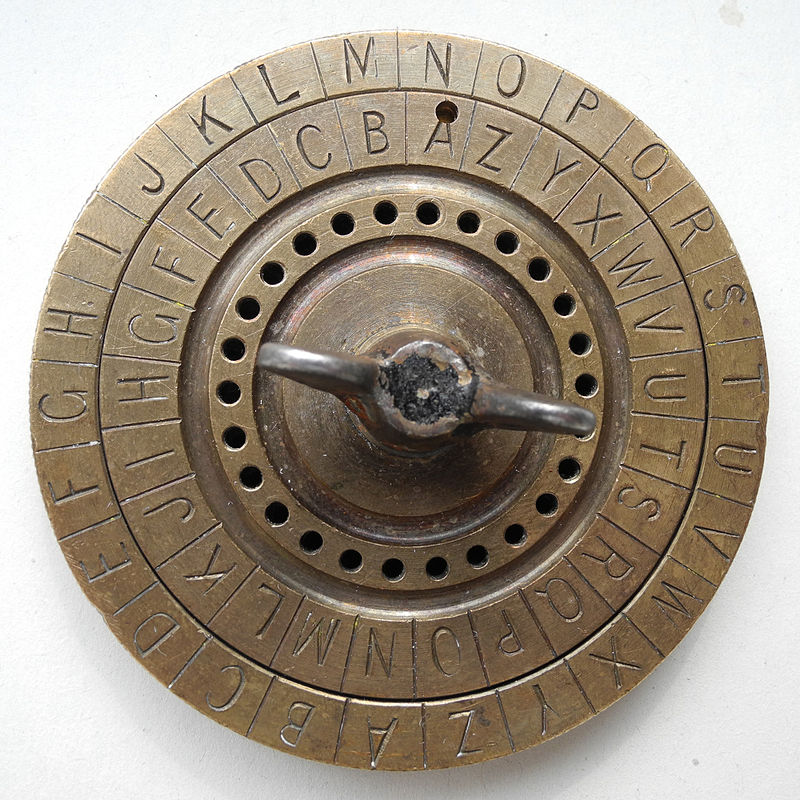
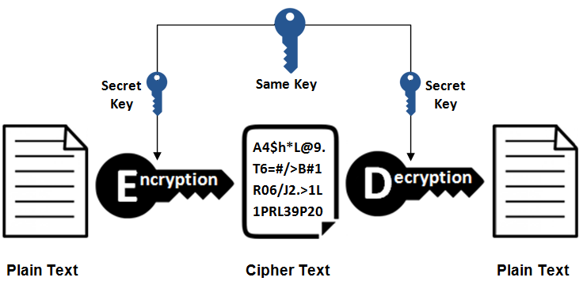
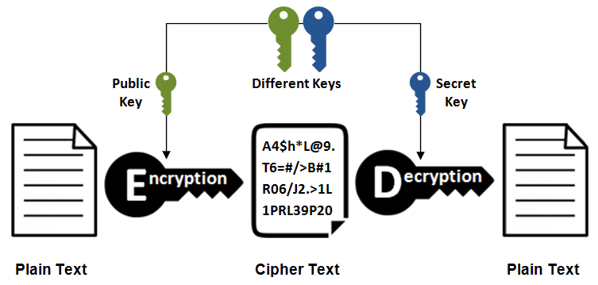

```{r setup, include=FALSE}

# chunk options
options(htmltools.dir.version = FALSE)
knitr::opts_chunk$set(
  fig.width = 9, fig.height = 3.5, fig.retina = 3,
  out.width = "100%",
  cache = FALSE,
  echo = TRUE,
  message = FALSE,
  warning = FALSE,
  hiline = TRUE
)

# pacotes utilizados
library(openssl)

# referencias
library(RefManageR)
BibOptions(check.entries = FALSE,
           bib.style = "authoryear",
           cite.style = "alphabetic",
           style = "markdown",
           hyperlink = FALSE,
           dashed = FALSE)
myBib = ReadBib("./bib.bib", check = FALSE)
```

```{r xaringan-themer, include=FALSE, warning=FALSE}
library(xaringanthemer)
style_duo_accent(
  primary_color = "#56af31",
  secondary_color = "#56af31",
  inverse_header_color = "#FFFFFF"
)
```

## O que é criptografia?

.pull-left[
  Do grego _kriptós_ (oculto, secreto) e _gráphein_ (escrita), criptografia é a ciência das técnicas de codificação e decodificação de informações.

  ### Ao longo da história

  O documento encriptado mais antigo que se tem registro data do século I AD, utilizado pelos militares no império romano de Júlio César.
]

.pull-right[
  ```{r, echo = FALSE, fig.cap = "fig. 1: Cifra de César", fig.topcaption = TRUE, fig.align = "center", out.width = "90%"}
  
  ```
]

---

### Ao longo da história

.pull-left[
  A invenção do computador está associada com criptografia. Durante a II Guerra Mundial, o primeiro computador foi desenvolvido para decriptar as comunicações nazistas codificadas através da _Enigma_.

  As mensagens geradas pela _Enigma_ eram encriptadas com uma chave que mudava diariamente.
]

.pull-right[
  ```{r, echo = FALSE, fig.cap = "fig. 2: Enigma", fig.align = "center"}
  knitr::include_graphics("img/enigma.jpg")
  ```
]

---
class: inverse center middle

# ALGORITMOS DE CRIPTOGRAFIA
---

## Criptografia de Chave Simétrica

Nos algoritmos de chave simétrica, há apenas uma chave comum usada para trancar e destrancar a "caixa" de encriptação e tanto o remetente quanto o destinatário têm a mesma chave.

```{r, echo = FALSE, fig.cap = "fig. 3: Encriptação simétrica", fig.align = "center", out.width = "70%"}


```
---
  
### Onde é usado?

- _Enigma_ (II GM)
- armazenamento de dados
- onde velocidade é importante (e.g., transações de cartão de crédito)

### Riscos

Como há uma única chave, ela deve ser compartilhada. Se o canal onde a chave é transmitida for comprometido e a chave for interceptada, a terceira parte poderá decifrar o texto.

---

## Criptografia de Chave Assimétrica

Nos algoritmos de chave assimétrica, apenas o receptor detém a chave. O receptor envia publicamente uma fechadura — o método de cifragem para trancar essa caixa hipotética —, para a qual apenas o receptor possui a chave. A fechadura é chamada de **chave pública** e a chave é chamada de **chave privada**, existindo apenas uma chave pública para cada chave privada.

```{r, echo = FALSE, fig.cap = "fig. 4: Encriptação assimétrica", fig.align = "center", out.width = "65%"}


```

---
  
### Onde é usado?

- verificação de identidade (e.g., assinatura digital, blockchain, apps de chat)
- onde segurança é importante

### Riscos

A criptografia assimétrica oferece melhor segurança porque usa duas chaves diferentes - uma chave pública que só é usada para criptografar mensagens, tornando-a segura para qualquer pessoa, e uma chave privada para descriptografar mensagens que nunca precisam ser compartilhadas.

- a chave privada nunca precisa ser compartilhada
- garante que apenas o destinatário pretendido possa descriptografar as mensagens codificadas e criar uma assinatura digital à prova de violação. 

---

class: inverse center middle

# CRIPTOGRAFIA E TEORIA DOS NÚMEROS <br> CIFRA DE CÉSAR
---
## Implementação da Cifra de César

Cada letra é associada a um número:

```{r echo=FALSE}
knitr::kable(
  t(data.frame(
    letras = LETTERS[1:13],
    numeros = 1:13
  )),
table.attr = "style='width:100%;'")
```

<br>

```{r echo=FALSE}
knitr::kable(
  t(data.frame(
    letras = LETTERS[14:26],
    numeros = 14:26
  )),
table.attr = "style='width:100%;'")
```

A palavra IFES, por exemplo, ficaria:
$$\text{IFES} = 9\;6\;5\;19$$

---

## Implementação da Cifra de César

Escolhemos então um número $b$ qualquer para deslocar as letras. Tomando $b=3$, por exemplo:

```{r echo=FALSE}
knitr::kable(
  t(data.frame(
    letras = LETTERS[1:13],
    numeros = 1:13
  )),
table.attr = "style='width:100%;'")
```

<br>

```{r echo=FALSE}
knitr::kable(
  t(data.frame(
    letras = LETTERS[14:26],
    numeros = 14:26
  )),
table.attr = "style='width:100%;'")
```

E a palavra IFES codificada fica:
$$12\;9\;8\;22 = \text{LIHV}$$
---
## Implementação da Cifra de César

Esse é um caso de chave simétrica. $b$ deve ser compartilhado com o receptador de forma que ele pudesse realizar a operação inversa para retornar à mensagem original:

$$
\begin{aligned}
\text{LIHV} = 12\;9\;8\;22 \\
(-3) \\
\text{IFES} = 9\;6\;5\;19
\end{aligned}
$$

Descrevendo matematicamente, 
$$
C \equiv P + b\; (\text{mod 26})
$$

Sendo $C$ o código numérico do texto cifrado, $P$ o código numérico do texto original e $b$ a chave.

---

class: inverse center middle

# CRIPTOGRAFIA E TEORIA DOS NÚMEROS <br> CRIPTOGRAFIA RSA

---
## Implementação de Algoritmo de Chave Assimétrica

Assim como na Cifra de César, começamos por transformar a mensagem em números:

```{r echo=FALSE}
knitr::kable(
  t(data.frame(
    letras = LETTERS[1:13],
    numeros = 10:22
  )),
table.attr = "style='width:100%;'")
```

<br>

```{r echo=FALSE}
knitr::kable(
  t(data.frame(
    letras = c(LETTERS[14:26], ""),
    numeros = c(23:35, 99)
  )),
table.attr = "style='width:100%;'")
```
<br><br>
$$\text{TEORIA DOS NUMEROS} = 29\;14\;24\;27\;18\;10\;99\;13\;24\;28\;99\;23\;30\;22\;14\;27\;24\;28$$

---
## Implementação de Algoritmo de Chave Assimétrica

- Para encurtar as mensagens, utiliza-se conversão binário-texto<sup>1</sup>

```{r}

mensagem = bignum("291424271810991324289923302214272428")
mensagem_base64 = base64_encode(mensagem)
mensagem_base64
```

.footnote[<sup>1</sup> não faz parte do processo matemático de encriptação]
---
## Implementação de Algoritmo de Chave Assimétrica

Com a mensagem pronta, o remetente gera duas chaves públicas $n$ e $e$ e uma chave privada $d$ da seguinte forma:

1. escolhe dois números primos $p$ e $q$ muito grandes, tal que $n=p*q$, pois
$$\phi(n) = \phi(pq) = \phi(p)\phi(q)=(p-1)(q-1)$$
2. escolhe outro número primo $e$, tal que $e$ seja inversível módulo $\phi(n)$ pois este será usado no processo de decodificação


---
  
### 1º problema: achar números primos

Solução: **Crivo de Eratóstenes** (`r Citet(myBib)`, p. 88)

```{r}
crivo = function(n) {

  # garantir que n é inteiro
  n = as.integer(n)
  
  # criando lista de primos de 1 até n supondo todos verdadeiros
  primos = rep(TRUE, n)

  # definindo 1 como não primo
  primos[1] = FALSE

  # definindo 2 como último primo
  ultimo_primo = 2L

  # determinando maior número a ser checado
  raiz_arredondada = floor(sqrt(n))

  # iterar
  while (ultimo_primo <= raiz_arredondada) {
    # retirando todos múltiplos do maior primo
    primos[seq.int(2L * ultimo_primo, n, ultimo_primo)] = FALSE
    # definindo o próximo maior primo
    sel = which(primos[(ultimo_primo + 1):(raiz_arredondada + 1)])
    if (any(sel)) {
      ultimo_primo = ultimo_primo + min(sel)
    } else {
      ultimo_primo = raiz_arredondada + 1
    }
  }

  # obter primos
  which(primos)
}

```
```{r}
# obtendo os primos até 1000
crivo(1000)
```

---
  
### 1º problema: achar números primos

Tempo de executação para encontrar $10^6$ primos:

```{r}

inicio = Sys.time()
n1 = crivo(1e+06)
fim = Sys.time()

fim - inicio
```

---
  
### 1º problema: achar números primos

Tempo de executação para encontrar $10^9$ primos:

```{r}

inicio = Sys.time()
n2 = crivo(1e+09)
fim = Sys.time()

fim - inicio
```
---
  
### 1º problema: achar números primos

- Tempo de processamento para encontrar os primos até $10^9$ é 2,1 mil vezes maior do que para encontrar os primos até $10^6$
- Seguindo a mesma proporção, levaria 47,3 horas para encontrar os primos até $10^{12}$
- Normalmente são utilizados números maiores que $10^{100}$ e a busca por primos maiores é contínua
---
### 2º problema: garantir a possibilidade de decodificação

- Para que seja possível a decodificação, $e$ deve ser inversível módulo $\phi(n)$, ou seja, $mdc(e, \phi(n)) = 1$.

**Relembrando (`r Citet(myBib)`, p. 118-121):**
- o conjunto de todas as classes residuais módulo $m$ é representado por $\mathbb{Z}_m$
- a vantagem das classes residuais é que transformam a congruência $a \equiv b \;(mod \;m)$ na igualdade $\bar{a} = \bar{b}$ e podemos realizar operações com essas classes
- um elemento $\bar{a} \in \mathbb{Z}_m$ é invertível se e somente se $(a,m) = 1$
- se $\bar{a}$ é invertível, então existe $\bar{b} \in \mathbb{Z}$ tal que $\bar{1}=\bar{a}.\bar{b}$, logo $a.b \equiv 1 \;(mod \;m)$
---
### 2º problema: garantir a possibilidade de decodificação

- conseguimos ver pela tabela de multiplicação que isso ocorre $\forall \;\bar{a} \in \mathbb{Z}_m$ apenas se $m$ for primo
- se $m$ não for primo, há pelo menos uma classe $\bar{a}$ não congruente a 1 módulo $m$
---
  
## Implementação de Algoritmo de Chave Assimétrica

Garantida a possibilidade de decodificação, o receptor envia a chave pública (i.e. o par $(n,e)$) ao emissor da mensagem para o processo de encriptação.

<br><br>

$$\text{TEORIA DOS NUMEROS} = 29\;14\;24\;27\;18\;10\;99\;13\;24\;28\;99\;23\;30\;22\;14\;27\;24\;28$$

<br>

Para encriptar um bloco $b_i$, toma-se o resto da divisão de $b_i^e$ por $n$, ou seja, $b_i^e\;(mod\;n)$. Supondo $p = 13$, $q = 17$, $n=p.q=221$ e $e=5$, então:

```{r echo=FALSE}

vetor = c(29, 14, 24, 27, 18, 10)
  
knitr::kable(
  t(data.frame(
    letras = c("T", "E", "O", "R", "I", "A"),
    numeros = vetor ^ 5 %% 221
  )),
table.attr = "style='width:100%;'")
```

---
  
## Implementação de Algoritmo de Chave Assimétrica

O emissor então envia a mensagem encriptada ao receptor que, de posse da chave privada, (i.e. o par $(n, d)$), sendo $d=(e \;mod \;\phi(n))^{-1}$ é o único capaz de decriptar os blocos $a_i$.

$$a_i = 139\;131\;215\;40\;18\;108$$

Para decriptar um bloco $a_i$, toma-se o resto da divisão de $a_i^d$ por $n$, ou seja, $a_i^d\;(mod\;n)$. Calculando $\phi(n)$:

$$\phi(n) = (p-1)(q-1) = (13-1).(17-1) = 192$$

E podemos calcular a inversa de $5 \;(mod\;192)$ aplicando o algoritmo euclidiano estendido, chegando a:

$$192.(-2)+5.77=1$$

concluindo que $5.77 \equiv 1 \;(mod \;192)$ e obtendo $d=(5 \;mod \;192)^{-1} = 77$.

Por fim, podemos calcular $a_1 = 139^{77} \;(mod\;221) = 29 = T$

---
  
## Implementação de Algoritmo de Chave Assimétrica

De forma programática:
```{r}

encriptar = function(mensagem, p, q, e) {
  
  if (!is.character(c(mensagem, p, q, e))) {
    stop("os argumentos devem ser caracteres")
  }

  p = openssl::bignum(p)
  q = openssl::bignum(q)

  # chave pública
  n = p * q
  e = openssl::bignum(e)
  print(
    paste(
      "chave pública: n =", n,
      "e =", e
    )
  )

  euler = (p - 1) * (q - 1)

  # chave privada
  d = openssl::bignum_mod_inv(e, euler)
  print(paste("chave privada:", d))

  # encriptar: mensagem^e %% n = 1
  mensagem = openssl::bignum(charToRaw(mensagem))
  mensagem_encriptada = openssl::bignum_mod_exp(mensagem, e, n)
  mensagem_base64 = openssl::base64_encode(mensagem_encriptada)

  print(paste("mensagem:", mensagem_base64))
}

decriptar = function(mensagem, d, n) {
  if (!is.character(c(mensagem, d, n))) {
    stop("os argumentos devem ser caracteres")
  }

  d = openssl::bignum(d)
  n = openssl::bignum(n)

  # tranformar de binário-texto para número
  c = openssl::bignum(openssl::base64_decode(mensagem))

  # decriptar
  m = openssl::bignum_mod_exp(c, d, n)
  m = rawToChar(m)
  print(m)
}

```

---

## Implementação de Algoritmo de Chave Assimétrica

**Exemplo de encriptação de mensagem**
```{r}

encriptar(
  mensagem = "demorei maior tempão pra entender essa parada",
  p = "112481050639317229656723018120659623829736571015511322021617837187076258724819",
  q = "89185111938335771293328323333111422985697062149139368049232365065924632677343",
  e = "65537"
)
```

---

## Implementação de Algoritmo de Chave Assimétrica

**Exemplo de decriptação de mensagem**
```{r}

decriptar(
  mensagem = "P26Dr9AhfkSkweOaW/8GAGsJaKlEzCAIUwPs3/X1kolRrzqWdop/wNKHM1g3sZzmQXboH7hfE02ZfAGG6WvHog==",
  d = "6886694454027199678759881881737814611139109676622117091683160716943132564863007715345245794849719693156483947830169207322284232384798025277322134502462181",
  n = "10031635092209121498674987861649022163771061565130441373555584537047455688991931937563110507506652959265182705476941444174840580049331773111276155053075917"
)

```

---
  
## Referências

```{r refs, echo=FALSE, results="asis"}
PrintBibliography(myBib)
```
